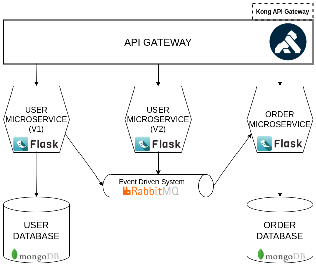

# Broken-Microservices 
## Project Overview

Broken-Microservices is a project designed to demonstrate the architecture and implementation of a microservices-based system. This project utilizes various technologies to build a robust and scalable system, including MongoDB for the database, Flask for the microservices, Kong for the API gateway, and RabbitMQ for the event-driven system.

## Architecture

The architecture of the Broken-Microservices project is composed of the following components:

- **MongoDB**: A NoSQL database used to store and manage data.
- **Flask**: A lightweight WSGI web application framework used to build the microservices.
- **Kong**: An API gateway that provides a single entry point for all the microservices, handling routing, authentication, and other API management tasks.
- **RabbitMQ**: A message broker that facilitates communication between the microservices in an event-driven manner.



## Running the Project

To run the Broken-Microservices project using Docker, follow these steps:

1. Ensure you have Docker installed on your Linux system.
2. Set the environment variables using the `.env.example` file as a template.
3. Execute the following command to build and run the Docker containers:

    ```bash
    docker compose down -v && docker compose build && docker compose up --force-recreate
    ```

This command will stop any running containers, build the images, and start the containers with the latest changes.

## Environment Variables

The project requires certain environment variables to be set for proper configuration. Use the `.env.example` file as a template to create your own `.env` file with the necessary values.

## Conclusion

The Broken-Microservices project showcases the implementation of a microservices architecture using modern technologies. By following the instructions provided, you can set up and run the project on your local machine, gaining insights into the workings of a microservices-based system.
